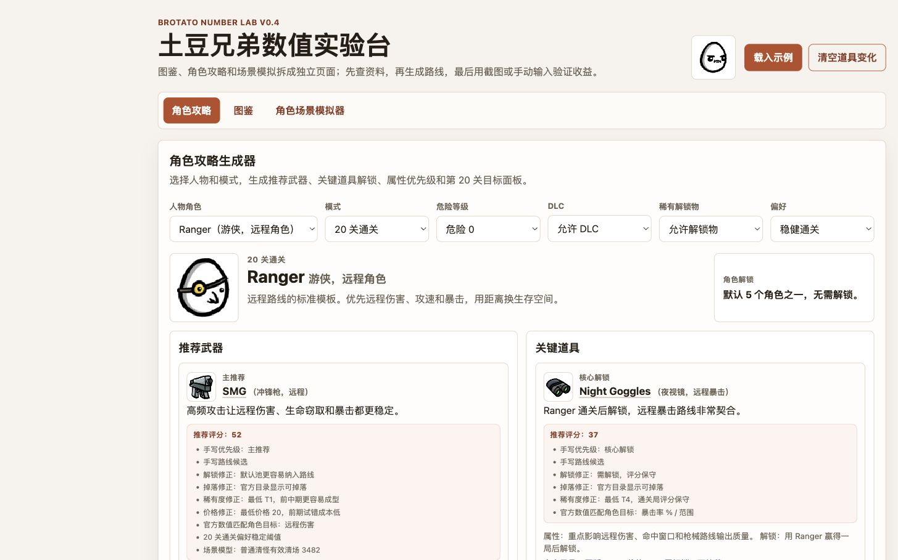

# Brotato Number Lab

《土豆兄弟》角色攻略、图鉴与场景数值模拟工具。项目基于仓库内的官方静态数据生成可解释的武器、道具与属性推荐，并支持手动面板和截图 OCR 辅助分析。

## 在线体验

当前部署：[https://brotato-8dvv.vercel.app/#guide](https://brotato-8dvv.vercel.app/#guide)

[](https://brotato-8dvv.vercel.app/#guide)

## 当前范围

- 按角色和模式生成攻略：
  - 推荐武器。
  - 关键道具和解锁方式。
  - 推荐武器和关键道具的属性说明。
  - 属性优先级。
  - 推荐第 20 关目标面板。
  - 支持危险等级、DLC、默认池/解锁池和流派偏好输入。
- 手动输入角色面板属性。
- 手动输入单种武器的基础伤害、属性缩放、冷却、暴击、数量。
- 选择战斗场景，估算穿透、弹射、爆炸、燃烧、诅咒、结构物、护甲、溢出、走位损失和拾取触发道具的收益。
- 手动输入一个候选道具带来的属性变化。
- 对比购买前后：
  - 单次非暴击伤害
  - 单次暴击伤害
  - 单次期望伤害
  - 攻击间隔
  - 总 DPS
- 三个独立页面：
  - 角色攻略页，默认展示；选择角色时同步展示角色图标。
  - 图鉴页，支持分类浏览、搜索和详情跳转。
  - 角色场景模拟器页，支持手动输入和上传截图/照片解析。

## 简化假设

基础公式处理普通命中期望；场景模型额外估算穿透、弹射、爆炸额外目标、拾取触发道具、燃烧覆盖/传播、诅咒倍率、结构物工程学、敌人护甲、溢出伤害、走位命中损失，以及移速和闪避合成的有效规避率。

这些扩展模型目前是可解释近似值，用于比较方向和敏感性；后续还需要继续从本机 `.pck` 资源中解析具体武器、道具、敌人和结构物参数。

核心公式：

```text
缩放后伤害 = 武器基础伤害 + Σ(属性值 × 对应缩放比例)
全局修正后伤害 = max(1, 缩放后伤害 × (1 + 总伤害% / 100))
暴击期望 = 非暴击伤害 × (1 - 暴击率) + 暴击伤害 × 暴击率
攻击间隔 = 武器基础冷却 / max(0.1, 1 + 攻速% / 100)
DPS = 单次期望伤害 × 每次攻击命中数 × 武器数量 / 攻击间隔
```

场景估算公式：

```text
有效武器 DPS = (基础 DPS + 穿透贡献 + 弹射贡献 + 爆炸贡献) × 护甲/溢出/走位交付倍率
特殊道具 DPS = 场景触发频率 × 触发概率 × 单次期望伤害
燃烧 DPS = 每跳伤害 × 覆盖率 × 跳数 × 传播倍率
结构物 DPS = 结构物伤害 × 发射频率 × 目标覆盖 × 有效时间 × 命中率
场景总 DPS = 有效武器 DPS + 特殊道具 DPS + 燃烧 DPS + 结构物 DPS
奖励修正清场评分 = 场景总 DPS × 诅咒奖励倍率 / 诅咒敌人强度倍率
```

当前场景预设：

- Boss / 精英单体：目标少，穿透、弹射和范围收益低。
- 普通清怪：常规波次估算。
- 高密度怪潮 / 无尽：怪多、拾取多，机制收益更容易放大。

## 使用

启动本地服务：

```bash
npm run start
```

然后访问 `http://localhost:5174`。

截图/照片解析使用 OpenAI 兼容视觉 API。本地开发默认启用，读取 `env.local`：

```bash
API_KEY="lm-studio"
API_URL="http://127.0.0.1:1234/v1"
MODEL="qwen3.6-35b-a3b-nvfp4"
MAX_TOKENS="10000"
OCR_TIMEOUT_SECONDS="1200"
USE_RESPONSE_FORMAT_JSON="false"
```

`env.local` 是本机配置文件，不提交；仓库里保留 `env.local.example` 作为模板。LM Studio 对 `response_format` 支持不稳定，默认不要开启 JSON mode；如果换成明确支持 JSON mode 的 OpenAI 兼容服务，再把 `USE_RESPONSE_FORMAT_JSON` 设为 `true`。

OCR 开关与保护参数（可选）：

```bash
OCR_ENABLED="true"            # 显式开关；本地默认 true，生产默认 false
OCR_MAX_IMAGE_BYTES="4194304" # 单张图片解码后上限，默认 4MB（Vercel 请求体平台上限 4.5MB）
OCR_MAX_IMAGE_DIMENSION="12000" # 单条边长上限（像素），默认 12000
OCR_MAX_IMAGE_PIXELS="20000000" # 单张图片总像素上限，默认 2000 万
OCR_MAX_REQUESTS_PER_MINUTE="10" # 按 IP 的滑动窗口限流
OCR_DAILY_QUOTA="100"          # 按 IP 的每日额度
OCR_MAX_CONCURRENCY="2"        # 按 IP 的并发上限
OCR_MAX_TOTAL_CONCURRENCY="4"  # 全局并发上限

# 生产启用 OCR 时必填，用于跨实例原子限流
UPSTASH_REDIS_REST_URL="https://...upstash.io"
UPSTASH_REDIS_REST_TOKEN="..."
```

**生产环境默认关闭 OCR**（`VERCEL=1` 或存在 `VERCEL_ENV` 时）。如需在线上启用，必须显式设置 `OCR_ENABLED=true`，并理解：线上图片会经 Vercel 转发给外部模型 API，存在隐私与成本影响。本地 OCR 默认最多等待 1200 秒；Vercel 部署受函数时长限制，程序会自动把线上等待时间限制为 285 秒，并在 300 秒的平台截止时间前返回。

服务端会对图片做严格校验：只接受 PNG/JPEG/WebP 的规范 base64 data URL，校验格式结构（包括 PNG chunk/CRC/IDAT/IEND、JPEG scan/EOI 和 WebP RIFF/chunk）、像素尺寸，并限制解码字节数（默认 4MB）、单条边长（默认 12000 像素）和总像素数（默认 2000 万）。

限流说明：本地开发使用进程内状态；生产环境必须配置 Upstash Redis 兼容 REST API（支持 `UPSTASH_REDIS_REST_URL/TOKEN`、`OCR_RATE_LIMIT_REST_URL/TOKEN` 或 Vercel KV 的兼容变量）。滑动窗口、每日额度、每 IP 并发与全局并发由一条 Redis Lua 脚本原子获取，跨函数实例共享；缺少配置或限流后端不可用时会 fail closed，OCR 返回 503 且不会调用模型 API。平台级防护仍建议作为纵深防御，详见 `docs/vercel-deployment.md`。

上传前客户端会先验证图片结构、边长和总像素数，再把横向截图（宽高比 >1.2，含 16:9、4:3、超宽屏）裁剪为右侧属性面板区域（右侧 40%）；竖版/方形图片视为已裁剪不再裁剪。之后自适应压缩为 JPEG（逐级降低分辨率与质量，data URL 上限 4MB），只发送处理后的图片。只支持 PNG/JPEG/WebP，单文件不超过 25MB、单条边长不超过 12000 像素、总像素不超过 2000 万。页面会展示当前模式（本地/线上代理）与隐私说明。

截图解析目前只做右侧属性栏 OCR，输出属性名和数字，再由前端映射到角色面板。只看静态页面时仍可用（静态模式不含 OCR 接口）：

```bash
npm run start:static
```

运行公式测试：

```bash
npm test
npm run verify:recommendations
```

检查全部武器/物品图鉴效果是否泄露内部脚本名或资源键：

```bash
npm run verify:effects
```

生成 Vercel 静态部署输出：

```bash
npm run build
```

输出目录是 `public/`。Vercel 部署时建议设置 Build Command 为 `npm run build`，Output Directory 为 `public`。

校验当前资料库里的中文名称是否出现在本机安装包：

```bash
npm run verify:names
```

默认读取 `***REMOVED***/Library/Application Support/Steam/steamapps/common/Brotato`。如果安装路径不同，可以设置 `BROTATO_INSTALL_DIR`。

从本机安装包提取官方武器/道具目录：

```bash
npm run extract:catalog
```

生成文件在 `data/official-catalog.json`，包含资源 ID、翻译 key、稀有度、价格、默认解锁状态、DLC 来源、官方 icon 资源路径，以及本地图片资产目标路径。

从本机安装包提取角色解锁挑战映射：

```bash
npm run extract:unlocks
```

生成文件在 `data/official-unlocks.json`。该脚本只读取安装包里的静态 `challenge` / achievement 资源，不读取玩家存档，因此不受本机已解锁进度影响。当前 54 条角色奖励映射都已写入精确简中条件：43 条来自原版 achievement CSV，另 11 条通过 Godot `OptimizedTranslation` 的双哈希表按 `descriptionKey` 直接读取安装包简中 `PHashTranslation`，并按 challenge 的 `value`、`stat`、`additional_args` 展开占位符。解析模块只接受未压缩 UTF-8 消息；不能可靠读取的文本仍会降级为 `pending-text`，不会猜测。若同一静态记录的中英文条件明确冲突，抽取器会保留原始简中、英文证据和纠正原因；当前 `chal_hungry` 已将误写的“20 把武器”纠正为“拾取 20 个消耗品”。角色图鉴会合并官方目录和策略层：当前展示 64 条官方角色记录，加上 `Giant / CHARACTER_GIANT` 这个已记录在 `data/official-character-catalog-gaps.json` 的审计条目；Giant 不进入普通攻略或模拟器角色选择器。Beast Master 与 Wounded 已有完整策略模板，不再属于 official-only。

生成集中待校验清单：

```bash
npm run unlocks:pending
```

生成文件在 `data/official-unlock-pending.json`，由 `data/official-unlocks.json` 里的 `pending-text` 记录派生。当前清单为 0 条；如果后续游戏版本新增无法可靠读取的挑战文本，脚本仍会保留角色攻略状态、官方 `nameKey`、静态 challenge key、数值、图标资源和阻塞原因。它同样只反映静态安装包数据，不读取本机存档。

从本机安装包导出图鉴 WebP 图标：

```bash
npm run extract:assets
```

导出的图片保存在 `data/assets/**`，并会回写 `data/official-catalog.json` 的 `imageAssetPath` 字段。线上部署只需要提交后的仓库文件，不需要 Brotato 安装目录。

校验攻略资料中的武器/道具是否能映射到官方目录：

```bash
npm run verify:catalog
```

`npm run extract:catalog` 会依次重建静态目录并刷新本地图片路径，避免只重抽字段后留下缺少 `imageAssetPath` 的中间状态。

重新抽取后可将工作区官方数据与最近提交比较：

```bash
npm run official-data:diff
```

该命令逐条比较目录、本地化、解锁和复杂效果清单，并单独报告产品版本、提取器版本与输入包哈希变化。它有意忽略单纯的 `extractedAt` 变化；需要在自动校验中把差异作为失败时，可运行 `npm run official-data:diff -- --fail-on-change`，也可用 `--ref <git-ref>` 指定基线。

页面启动时会读取 `data/official-catalog.json` 和 `data/official-localization.json`，在推荐武器和关键道具下方补充官方来源、阶数、价格、解锁、掉落池状态、图片和中文名。角色、武器与物品名称当前均按官方 `nameKey` 查询安装包静态简中 PHashTranslation；未来新增且无法可靠读取的名称才会显示为待本地化。目录抽取器会区分 Godot `[resource]` 与 `[sub_resource]`，避免把 `arg_key/arg_value` 误当主效果；可稳定读取的主效果 key、数值、缩放来源、目标属性和关联武器/爆炸/燃烧资源参数会精确展示，仍未解码的内部参数才保守标注。攻略推荐会把全量官方武器/道具图鉴作为补充候选池参与评分，手写路线仍优先展示，道具页会补充前 24 个高分官方候选。触发伤害、条件伤害、击杀治疗、水果掉落、暴击材料、拾取双倍材料、拾取吸附、收获成长、箱子材料、单次回收材料、箱子额外道具、战利品外星人、波次存钱、每波结束属性成长、下一波经验、贯通覆盖和商店效率等道具会优先从官方 effect 字段动态生成场景收益模型；例如 `Cyberball（赛博球）` 按官方 `dmg_when_death` 作为击杀触发、25% 幸运伤害估算，`Silver Bullet（银质子弹）` 按官方 Boss 加伤估算，`Goblet（高脚杯）` 按击杀频率估算治疗期望，`Fruit Basket（果篮）` 只估算额外消耗品机会而不猜水果治疗量，`Recycling Machine（回收装置）` 按每次回收额外 35 材料解释，`Pearl（珍珠）` 同时保留幸运成长与每箱 3% 同名道具机会，`Whistle（哨子）` 会显示 50% 战利品外星人机会及其 20% 移速追逐风险，`Robot Arm（机械臂）` 会按官方 `stats_end_of_wave` 解释工程学每波成长，`Peacock（孔雀）` 会按官方 `stats_next_wave` 解释下一波经验潜力并用敌人风险折扣，`Bandana（头巾）` 会按官方 `piercing` 解释怪潮贯通覆盖，`Coupon（优惠券）` 会按官方 `items_price` 解释物品折扣。宠物条目会额外读取官方关联资源中的武器、爆炸、燃烧和地雷静态参数，按“单只宠物、静态攻击间隔/伤害”的保守模型评分，不假设触发次数、命中率、宠物数量或存活时间。幽魂武器会按逐阶 `20/18/16/12` 次该武器击杀换算每 100 杀永久成长；骑士会按官方每 1 护甲 `+2` 近战伤害并过滤远程武器；幸运星会把官方 75% 拾取触发、15% 幸运伤害与候选的幸运、总伤害和拾取吸附合并为边际 DPS。
Lucky 默认允许 DLC 时会优先显示 `Lute（琉特琴）`；切换到“仅原版”时会隐藏该 DLC 武器。

## 部署和图片资产

本机安装目录只用于开发时提取资料。页面运行和线上部署不读取 Steam 安装目录，也不读取 `.pck` 文件；部署时所有数据都应保存在项目内的 `data/*.json` 和后续导出的 `data/assets/**` 中。

角色、武器、物品配图的资产管线见 [docs/assets-and-deployment.md](docs/assets-and-deployment.md)。

## 后续目标

二期攻略生成器已经接入 64 条官方角色策略模板；`Giant / CHARACTER_GIANT` 仅作为图鉴和校验报告中的已审计目录缺口保留，不进入普通攻略或模拟器选择器。角色、武器和物品图鉴本地化已覆盖当前官方目录，54 条已抽取角色挑战均有精确简中条件；攻略对象直接引用生成的 `src/officialUnlocks.js`，不再保留运行时二次覆盖的占位文案。复杂效果审计当前覆盖 128 条记录，运行时待解码已从 56 条降至 14 条；Lucky、Knight、Ghost、Engineer、Druid、Beast Master、Wounded 的普通/无尽 Top-N，以及 DLC、默认池和六类偏好组合均有固定回归。

规格见 [docs/strategy-generator.md](docs/strategy-generator.md)。
推荐规则维护见 [docs/recommendation-logic.md](docs/recommendation-logic.md)。
图片和部署数据约束见 [docs/assets-and-deployment.md](docs/assets-and-deployment.md)。
Vercel 部署清单见 [docs/vercel-deployment.md](docs/vercel-deployment.md)。
当前修复与优化优先级见 [docs/remediation-plan.md](docs/remediation-plan.md)。

## 资料来源状态

当前攻略数据参考 Brotato Wiki 的 Characters、Progress、Weapons、Stats 和 Endless Mode 页面，并在数据里保留了解锁说明。攻略推荐本身是策略化整理，不等同于游戏内唯一最优解；当前已把官方武器数值、解锁/掉落状态、稀有度、价格、套装匹配、官方触发与 Boss/高生命条件伤害、暴击/拾取/箱子/回收/战利品外星人/波次经济、每波结束属性成长、下一波经验风险收益、官方贯通覆盖、官方商店效率、水果掉落与拾取频率收益、击杀/暴击击杀/拾取/消耗品即时与持续/闪避治疗续航、诅咒/敌人风险经济、爆炸/燃烧/结构物及结构物暴击覆盖潜力、官方幸运/护甲缩放、击杀成长机制、宠物关联资源静态参数和官方自定义成长缩放来源接入可解释评分。双值效果、时间窗口和 `sub_effects` 已用于展示 Giant Belt、高低生命阈值、临时属性间隔、琉特琴承伤窗口、标枪/贝壳强化、异形眼球、胡子宝宝、害怕的香肠和沉没之钟；未完全解码的运行时链路仍会标为 `partial-static-decode` 或 `pending-runtime-decode`，不伪造精确 DPS。

官方简中名称优先以本机安装包里的 `Brotato.pck` 和 `BrotatoAbyssalTerrors.pck` 为准；`npm run verify:names` 会扫描这些包并报告当前数据是否匹配。

当前可从官方目录稳定校验武器/物品/角色的默认解锁状态和掉落池状态：

```bash
npm run verify:unlocks
```

精确挑战条件来自安装包静态 Progress / achievement / challenge 资源。`data/official-unlocks.json` 当前记录 54 条角色奖励映射，全部带有 `verified-static-text` 简中条件；原版 CSV 未覆盖的后补挑战与 DLC challenge 会用静态 `descriptionKey` 查询简中 `PHashTranslation`，再按 challenge 脚本规定的参数顺序展开占位符。`npm run unlocks:pending` 仍会维护无法可靠读取的新条目，当前输出 0 条。`npm run verify:unlocks` 反向报告已抽到但策略层尚未维护的官方角色解锁记录：当前 0 条 warning、0 条 pending-text。精确条件由 `data/official-unlocks.json` 单向生成 `src/officialUnlocks.js`，每个攻略对象直接引用该模块，不维护第二份文案，也不在对象创建后再次覆盖。已审计的策略层目录缺口会单独列入 `Audited catalog gaps`，避免和真正待处理 warning 混在一起；`Giant / CHARACTER_GIANT` 仅保留缺口证据，不映射到 Giant Belt、Giant Slayer 或 Giant 敌人资源。

这不依赖当前电脑的存档解锁进度。安装包 `.pck` 是静态游戏数据；本机进度只会影响游戏内或存档里“你已经解锁了什么”，不会改变仓库中由安装包提取出的官方目录字段。除非后续改为读取存档或游戏 UI 截图，否则本机是否已经全解锁不会影响这些脚本的结果。
